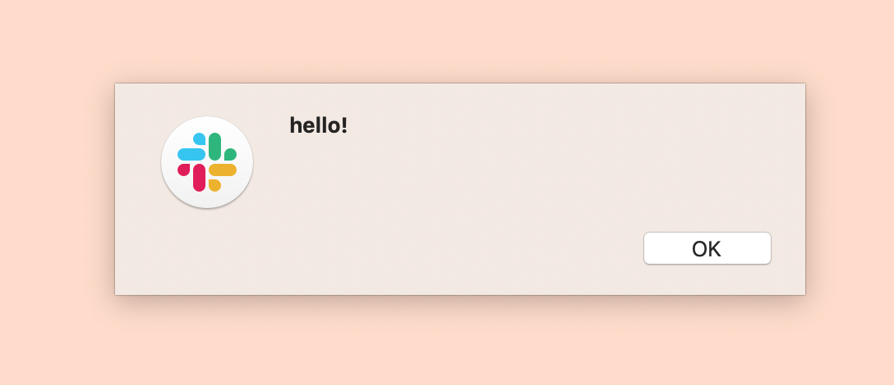
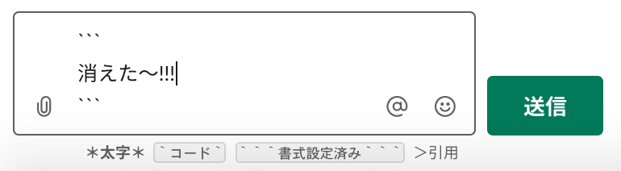

## 参考記事

[focus97/hack-yo-own-slack-theme.md](https://gist.github.com/focus97/21a8b7f130f0afd0b26f0d84f3a02d2b)

## はじめに

現在、Slack の WYSIWYG については、賛否両論に分かれる評価がされているかと思われます。
おそらく、近日中にWYSIWYGを無効化するオプションがリリースされるのではないかと思われます。

さて、Qiitaでは[Slack の WYSIWYG を無効にしたい](https://qiita.com/tdkn/items/2e12707b7a44fa8ee087)という記事が公開されるなど、Slack Desktopの開発者ツールからWYSIWYGを無効化する方法が広まっています。

しかし、起動するたびに開発者ツールを開き、ブックマークレットを貼り付けるのは、いささか大変かと思われます。

この記事では、macOS環境において、 `/Applications/Slack.app` の内部を改変し、 `${HOME}/.slackrc.js` を読み込ませることで、開発者ツールを開かずにWYSIWYGを無効化する方法を紹介します。

以下で紹介する方法は、Slackの予期せぬ動作を引き起こす可能性がある上に、セキュリティ上の危険を伴う可能性があります。著者は、以下の方法を試したことによって発生するいかなる損害についても責任を一切取ることができません。ご注意下さい。

## 1. asar をインストールする

asarは、GitHubがElectronでアプリケーションをパッケージングするために開発した、tarライクのフォーマットでファイルを圧縮・解凍するツールです。

Slackは、Electronを利用して開発されており、asarによってソースコードを圧縮されています。
早速解凍して、編集しやすい形式に戻しましょう。

まず、.asarファイルを解凍するために、asarコマンドをインストールしましょう。

```bash
npm i -g asar
exec $SHELL -l
```

## 2. app.asar を解凍し、バックアップする

次に、`app.asar`を解凍します。
Slackはまず`app.asar`を読み込み、`app.asar`が見つからなければ`app`ディレクトリを参照します。
そのため、解凍した後は`app.asar`を別ファイルとして移動します。

```bash
cd /Applications/Slack.app/Contents/Resources/
sudo asar extract app.asar app
mv app.asar app.asar.bak
```

## 3. ソースコードを編集し、`${HOME}/.slackrc.js`を読み込ませる

`app/dist/ssb-interop.bundle.js` を開きましょう。

```bash
cd /Applications/Slack.app/Contents/Resources/
vim app/dist/ssb-interop.bundle.js # お好きなエディターでどうぞ
```

次に、`app/dist/ssb-interop.bundle.js`の末尾に以下のコードを貼り付けましょう。

```js
const fs = require('fs')
// `/Users/uni/` は適宜あなたのホームディレクトリに置き換えてください!
fs.readFile("/Users/uni/.slackrc.js", (error, data) => {
    if (error != null) {
        console.error("file open error.");
        return;
    }
    // TODO: 危険
    eval(data.toString());
});
```

そして、`$HOME/.slackrc.js`を編集します。試しに、アラートを鳴らしてみましょう。

```js
alert("hello!");
```

そしてSlackを起動してみましょう。すると、アラートが表示されるはずです。


### 4. WYSIWYGをオフにする

最後に、`$HOME/.slackrc.js`を編集し、WYSIWYGをオフにしてみましょう。

```js
// DOMツリーを監視する
document.addEventListener("DOMContentLoaded", function() {
  const observer = new MutationObserver(mutations => {
    mutations.forEach(_ => {
      // WYSIWYG切り替えボタンが表示されていたらオフにする
      if (document.querySelector('[data-qa="texty_composer_button"]') != null) {
        slackDebug.clientStore.workspaces.getAllWorkspaces().forEach(id => {
          const { redux } = slackDebug[id];
          const {
            wysiwyg_composer,
            wysiwyg_composer_ios,
            wysiwyg_composer_webapp,
            ...payload
          } = redux.getState().experiments;

          redux.dispatch({
            type: "[19] Bulk add experiment assignments to redux",
            payload
          });
        });
      }
    });
  });

  const config = {
    attributes: true,
    childList: true,
    characterData: true,
    subtree: true
  };

  const target = document.querySelector("body");

  observer.observe(target, config);
});
```

消えましたね！


## おわりに

私にとっては不便なWYSIWYGエディタも、誰かにとっては便利なのだと思います。
公式の方が対応してくださるのを待ちましょう。
