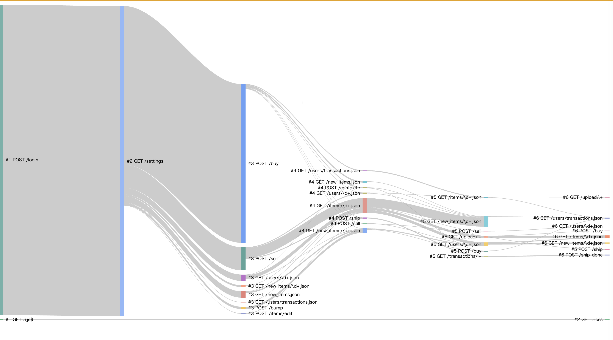

## はじめに

2020/09/28 に開催された ISUCON10 で予選敗退。  
とても楽しい問題でしたが、無残にも敗れ去りました。  
来年に向け、事前準備および当日にやったことを振り返ります。

なお、チームメイト @genya0407 の参加記は [こちら](https://genya0407.github.io/post/isucon10) になります。

## 記録

「ここにチーム名を入れる」というチーム名で [@genya0407](https://twitter.com/genya0407) と出場。  
Go 実装を使用し、結果は 1300 点でした。

## メンバー

- [@ebiebievidence](https://twitter.com/ebiebievidence) (私)
  - 初参戦  
  - デプロイ環境を整える
  - アプリケーション
- [@genya0407](https://twitter.com/genya0407)  
  - ISUCON8, ISUCON9 に続き参戦  
  - インフラ
  - スロークエリを見てインデックスを張ったり
  - アプリケーションのコード修正もしていた
  - (全部)

## 事前準備

### 初動

ISUCON7 および ISUCON8 の予選をベースに、主に初動の練習をしました。  
私は ISUCON について完全な素人であり、@genya0407 から色々と教わりながら以下のように初動を分担しました。
この初動の訓練はかなり重要でした。適切な分担決めを行うには、それぞれの得意・不得意を適切に知っておく必要があります。
また、デプロイコマンドやログローテートの仕組みなどは、何度か訓練を重ねることである程度汎用的なモノに仕上がってきます。

最終的には、初動は以下の流れで作業することにしました。

1. マニュアル読み合わせ (二人で)
1. アプリを一通り触る(二人で)
1. ここからは作業分担
    - @genya0407
        1. `/etc/hosts` をチームメンバーに配る
          ホスト名を揃えておくと何かとコマンドを共有しやすくて便利
        1. nginx.conf に LTSV のログを出力する設定を加える
        1. my.cnf にスローログを出力する設定を加える
        1. alp をインストールする
    - @ebiebievidence
        1. アプリコードおよびデータベースのマイグレーションファイルを GitHub リポジトリに上げる
        1. デプロイコマンドを作る
          デプロイ時に必ずログファイルをローテートする
        1. docker-compose で利用可能なローカル開発環境を構築する
        1. アプリコードにプロファイラを仕込む
1. 各種プロファイルの結果を見ながら方針を決定する (二人で)

### ツール

以下のツールを利用することとしました。
今回は New Reric の無料ライセンスが利用できるなど、最新のツールを利用することもできましたが、使い慣れたツールを利用することにしました。
netdata を導入することも検討しましたが、 `htop` と `vmstat` で十分必要な情報が得られると判断し、導入を見送りました。

- alp
- pt-query-digest
- [fgprof](https://github.com/felixge/fgprof)
  - Off-CPU な実行時間ベースで計測できる Golang プロファイラ
  - 標準ライブラリに含まれている pprof は On-CPU な実行時間ベースでのみ計測するため、DB や外部 API など外部とのやりとりで時間を溶かしている部分を見つけられない

#### **自作のシナリオ可視化ツール**

「それぞれのユーザがどのような動線を辿っているかを可視化できれば、どのエンドポイントがクリティカルであるか分かるのでは」という @genya0407 の天才的な提案がありました。

nginx の `userid` 機能を利用してトラッキング Cookie を付与することで、それぞれのユーザがエンドポイントを叩く順番を可視化することができます。

それを受けて、私は LTSV 形式の access.log をパースしてユーザごとの辿る経路をサンキー図で出力する CLI を作りました。

以下は、 ISUCON9 予選のログをこの CLI に読ませた結果です。 ほとんどのユーザはログイン後すぐに `POST /sell` または `POST /buy` のいずれかを叩き、その後 `GET /items/id.json` や `GET /new_items/id.json` を回遊していることなどが分かります。



## 当日

### 流れ

初回ベンチで CPU リソースが足りていないことがわかったため、まず CPU への負荷を減らすことが重要だと考えました。

初動が完了したら、以下の流れで改善を行いました。

1. fgprof, pt-query-digest でボトルネックを探す
1. より低いコストで改善できそうなボトルネックから改修を行う
1. ローカル環境で動作確認
1. 問題がなさそうであれば PR を作る
1. PR をもう一人がレビューをし、問題がなければデプロイしてベンチを回す
1. 点数が下がっていなければマージする (1. に戻る)

### コミュニケーション

基本的には Zoom でつなぎっぱなしにしつつ、困ったり詰まったりしたら画面共有をしてペアプロ風に進めました。
レビューして欲しい PR や、プロファイルの結果などは Discord で送った上で、Zoom で一言声を掛けるようにしました。
また、何か行動を開始する時は Zoom で声を掛けてから行うようにしました。

小規模なチームであれば、Zoom を繋ぎっぱなしにしてしまえばかなりスムーズにコミュニケーションが取れることがわかりました。
一方、意識的に記録に残さなければ後から参照することができないという欠点はあります。
特に、何かしら話し合いが行われたら、その話し合いが完了し次第すぐに決まったことと次にやることをきちんと Discord なり Slack なりにメモしておくことが重要です。

### 実施したこと

ほぼ @genya0407 がやってくれました。私、精進します...

#### bot からのリクエストが来ているか判断した

@genya0407 が access.log を シェル芸でいい感じに解析して、bot からのリクエストが来ているか確認した。
しかし、ほぼ全く来ていなかったため、対策を見送った。

**反省**  
実は、ボットはある程度サービスの負荷が減ると登場するという仕組みだったらしいです。しかし、そこに気づかずに最後までここの対策をしませんでした。どうやったら気がつくことができたのか...次回に向けた具体的な対策は浮かびません。

#### ユーザの行動の追跡

トラッキング Cookie を nginx から返すようにした上で、先程紹介した自作のシナリオ可視化ツールを利用して、ユーザの行動の追跡を試しました。

しかし、今回のベンチマーカーはクッキーを保持しなかったため、この方法による追跡は失敗してしまいました。

そこで、慌てて User-Agent ヘッダーの値をユーザ特定の条件として再度追跡を試しました。回遊を見た結果、 `/buy` までにたどり着くのがとても長いことが分かったため、`/buy` までに辿る経路もパフォーマンスを上げなければならないことが分かりました。


**反省**  
「ベンチマーカーは必ず `GET /api/estate/low_priced` エンドポイントを叩く」ということは競技後に知りました。ここが分かれば、「じゃあまずはそこをよく観察する必要があるよね」という話に持っていけたのですが、なんと上の図をよく見るとそれが読み取れたんですね...。焦りは禁物とはよくいいますが、人間は焦ってしまう生き物ですから、焦っている状態でもすぐ見てわかるような出力ができるツールにしたいと想います。いい感じになったら公開する予定です。

また、実は各リクエストの UA 文字列の末尾には UUID が付与されており、 UA 文字列からユーザをトラッキングできました。現実世界では Google Chrome や Microsoft Edge が UA 文字列を固定化するなど、UA 文字列からユーザを特定できないようにプライバシーが保護されるような仕組みが導入されつつあります。しかし、 ISUCON ならではのこのような仕掛けに気付く発想を持つことができれば、よりよいスコアが目指せたなと反省です。

#### MySQL 8 へのアップグレード (中止)

私の「MySQL 8 なら色々機能増えてるしパフォーマンスも良くなってるっぽいし、MySQL 8 に上げるっしょ！」という雑な思いつきに @genya0407 が付き合ってくれて MySQL 8 へアップグレードしてくれましたが、スコアが爆下がりするという事件が発生したため中止されました。binlog を無効する必要があったようです。

**反省**  
MySQL 8 の機能をよく知らないのに MySQL 8 へのアップグレードをなんとなくの気持ちで提案してしまった私は、MySQL 8 の機能をきちんとキャッチアップするか、自分が知っている範囲の知識で地に足つけて戦うかするべきです。

#### DB サーバと Web サーバを 1 台ずつの構成に

CPU への負荷を下げるために、@genya0407 が DB サーバと Web サーバを分けてくれました。
確かここで 1000 点台に乗った気がします。

#### popularity を逆にする

@genya0407 がスローログを見ていく中で、 `GET /api/estate/search` エンドポイントで発行されている以下のクエリについて、 ソート時にインデックスが使われていないことに気が付きました。

```sql
SELECT * FROM estate WHERE ... ORDER BY popularity DESC, id ASC LIMIT ? OFFSET ?
```

MySQL 5.x では降順インデックスが利用できないため、 popularity を初期化時に逆にしてあげることで上記クエリを `ORDER BY popularity ASC, id ASC` に書き換え、インデックスでソートできるようにしました [(#8)](https://github.com/isucon-genya-uni/isucon10y/pull/8)。

#### いい感じにインデックスを貼る

@genya0407 がスローログを見ながらいい感じにインデックスを貼っていきました。

```sql
create index e1 on isuumo.estate (popularity);
create index estate_rent on isuumo.estate (rent);
create index estate_point on isuumo.estate (latitude, longitude);
create index i1 on isuumo.chair (price);
```

例: [#6](https://github.com/isucon-genya-uni/isucon10y/pull/6)

```sql
-- 変更前:
MySQL [isuumo]> explain SELECT * FROM chair WHERE stock > 0 ORDER BY price ASC, id ASC LIMIT 20;
+----+-------------+-------+------------+------+---------------+------+---------+------+-------+----------+-----------------------------+
| id | select_type | table | partitions | type | possible_keys | key  | key_len | ref  | rows  | filtered | Extra                       |
+----+-------------+-------+------------+------+---------------+------+---------+------+-------+----------+-----------------------------+
|  1 | SIMPLE      | chair | NULL       | ALL  | NULL          | NULL | NULL    | NULL | 28907 |    33.33 | Using where; Using filesort |
+----+-------------+-------+------------+------+---------------+------+---------+------+-------+----------+-----------------------------+

-- 適用したインデックス:
create index i1 on isuumo.chair (price);

-- 変更後:
MySQL [isuumo]> explain SELECT * FROM chair WHERE stock > 0 ORDER BY price ASC, id ASC LIMIT 20;
+----+-------------+-------+------------+-------+---------------+------+---------+------+------+----------+-------------+
| id | select_type | table | partitions | type  | possible_keys | key  | key_len | ref  | rows | filtered | Extra       |
+----+-------------+-------+------------+-------+---------------+------+---------+------+------+----------+-------------+
|  1 | SIMPLE      | chair | NULL       | index | NULL          | i1   | 4       | NULL |   20 |    33.33 | Using where |
+----+-------------+-------+------------+-------+---------------+------+---------+------+------+----------+-------------+
```

#### 範囲検索を ID 検索に置き換え

たとえば、家賃 (rent) については検索画面では 4 種類の範囲しか選べませんが、DB へのクエリでは `rent >= ? AND rent < ?` のように範囲検索がされていました。これらについて、 DB に `rent_id` を設け、 `rent_id` で検索できるようにしました。

```go
for _, r := range estateSearchCondition.Rent.Ranges {
    if r.Max > 0 {
        query := `UPDATE estate SET rent_id = ? WHERE rent >= ? AND rent < ?`
        _, err := db.Exec(query, r.ID, r.Min, r.Max)
        if err != nil {
            panic(err)
        }
    } else {
        query := `UPDATE estate SET rent_id = ? WHERE rent >= ?`
        _, err := db.Exec(query, r.ID, r.Min)
        if err != nil {
            panic(err)
        }
    }
}
```

この修正を door_width や price などにも横展開し適用しましたが、後述の理由により十分スコアが伸びませんでした。

**反省**  
インデックスを `rent_id` のみに貼ってしまい、 `popularity` と複合インデックスで貼らなかったことからスコアは大きく伸びませんでした。後々`alp -q` で振り返ると、検索エンドポイントへのアクセスのほとんどは単純な条件による検索だったため、 `rent_id, popularity` とか `price_id, popularity` とか貼っておけばいい感じにスコアが伸びたのかもしれません。ユーザ、もといベンチマーカーの動きは例年必ずクセがあるので、これを見落とさないように alp の結果を見る時はクエリパラメータも含めて見るべきですね。

加えて、境界値を誤る痛恨の不具合を入れてしまい、この原因究明に時間を費やしてしまいました。境界値周りはあまりにも有名な凡ミスである一方で、焦っている時ほど踏みがちですから、気をつけたいですね。

また、コストが高い対応については本当に必要かよく検討し、必要であれば方針を言語化してレビューなどをしてもらうべきだったかもしれません。

#### COUNT(*) の結果をキャッシュ

pt-query-digest および fgprof から、物件検索でも椅子検索でも `COUNT(*)` が CPU 時間を食いつぶしていることが分かりました。
初めは DB にキャッシュ用のテーブルを作ってそこにキャッシュさせましたが、あまりスコアが伸びなかったためアプリのメモリに載せました。\([#12](https://github.com/isucon-genya-uni/isucon10y/pull/12) および [#16](https://github.com/isucon-genya-uni/isucon10y/pull/16)\)

ちなみに、 [catatsuy/mercari_go_isucon.md](https://gist.github.com/catatsuy/e627aaf118fbe001f2e7c665fda48146) を参考にさせて頂きました。Golang の `sync.RWMutex` は気軽に使えて便利です。

```go
type countMap struct {
    sync.RWMutex
    count map[string]int64
}

func (c *countMap) Set(key string, value int64) {
    c.Lock()
    c.count[key] = value
    c.Unlock()
}

func (c *countMap) Get(key string) (int64, bool) {
    c.RLock()
    v, found := c.count[key]
    c.RUnlock()
    return v, found
}

func (c *countMap) Clear() {
    c.RLock()
    c.count = make(map[string]int64)
    c.RUnlock()
    return
}

func NewCountMap() *countMap {
    m := make(map[string]int64)
    c := &countMap{
        count: m,
    }
    return c
}

func searchEstates(c echo.Context) error {
    // (中略)
    count, ok := estateCountMap.Get(hash)
    if ok {
        res.Count = count
    } else {
        err = db.Get(&res.Count, countQuery+searchCondition, params...)
        if err != nil {
            c.Logger().Errorf("searchEstates DB execution error : %v", err)
            return c.NoContent(http.StatusInternalServerError)
        }
        chairCountMap.Set(hash, res.Count)
    }
    // (中略)
}

func postEstate(c echo.Context) error {
    // (中略)
    estateCountMap.Clear() // invalidate
    if err := tx.Commit(); err != nil {
        c.Logger().Errorf("failed to commit tx: %v", err)
        return c.NoContent(http.StatusInternalServerError)
    }
    return c.NoContent(http.StatusCreated)
}
```

#### なぞって検索の DB クエリのソートをアプリでやる

なぞって検索は検索結果が 50 件前後ですが、ソートが重かったっぽいのでアプリでやるように @genya0407 が改修してくれました[(#15)](https://github.com/isucon-genya-uni/isucon10y/pull/15)。

## 上記以外の反省

### デプロイフローの確立は第一に行うべき

今回は fgprof をアプリに仕込んでからデプロイフローの確立を行いました。デプロイフローが確立されるまでに時間がかかったため、インデックスを貼るなどのスキーマを書き換える作業の反映が安全にできませんでした。デプロイフローの確立こそ、最初に行うべきでした。

### @ebiebievidence がこれから学ぶべきこと

来年に向けて、これからの業務に向けて、私は以下を学ぶべきであると思いました。

- MySQL のインデックス  
  現在でも多くの業務アプリケーションで利用されている MySQL のパフォーマンスをチューニングするためには、
  特にインデックスについてよく勉強する必要があると感じました。
- シェル芸  
  @genya0407 はシェル芸を駆使し、ログを迅速に分析していました。  
  時間が限られている ISUCON や障害対応では、シェル芸は非常に役立つことが分かりました。

### チームの役割編成

初動終了後、@genya0407 が主にインデックス追加やクエリ改善などの DB からのアプローチ、@ebiebievidence が主にアプリケーションからのアプローチで改善に取り組みました。お互いが自分の得意な部分に集中して取り組むことができた一方で、俯瞰的にログやプロファイルを観察して方針を決定する司令官的存在が不在となりました。

また、インフラ的な知識がチームにないため、カーネルパラメータや MySQL のチューニングには取り組みませんでした。来年はインフラに詳しいメンバーも加えて参加できればいいなと思いました。

### 初動に時間がかかってしまった

MySQL 8 へのアップグレードや、ローカル環境の準備などに時間を要し、初動に時間がかかってしまいました。特に、ローカル環境の準備については私が担当でしたが、@genya0407 の方が知見が深かったため、うまくいかないタスクについては早めに相談するべきでした。

### シャーディング完全に思いつかなかった

一部のチームでは、物件と椅子のテーブルをシャーディングし、別のホストで提供する方法を取っていました。完全に思いつかなかった...。こういう思考が持てたらよかったなと思いました。

## まとめ

問題を楽しむことができた一方で、来年に向けた課題が多く見つかった ISUCON 10 予選となりました。
来年はよりレベルアップできるように、この一年は精進していきたいです。
