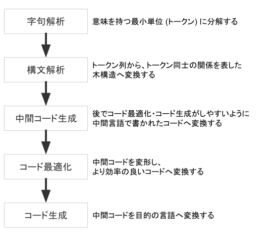
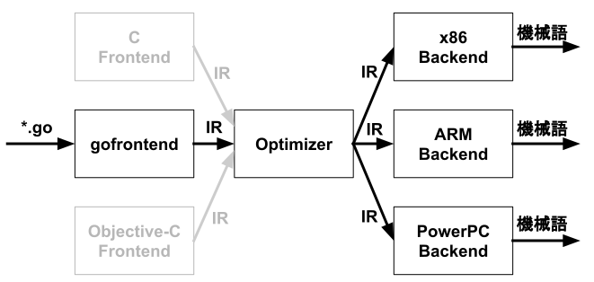
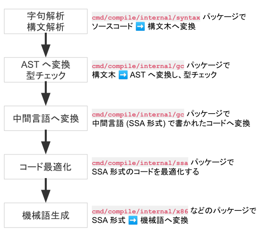

## はじめに

本記事は、 [DeNA Advent Calendar 2020](https://qiita.com/advent-calendar/2020/dena) の 11 日目の記事です。

本記事では、Go コンパイラ `gc` のコードを読むためにあると嬉しい知識を整理した上で、実際に `gc` のコードの流れを途中までざっくりと追っていきます。

想定している読者は以下の通りです。コンパイラについてよく知らなくても、Go の基礎的な文法を理解している方であれば読み進められるように書いています。

- コンパイラに興味がある方
- コンパイラのコードを読んだことがない方

なお、コードリーディングについては AST への変換までを対象としています。
また、本記事では再帰降下構文解析の具体的な実現手段や、SSA・機械語への変換の手順などは紹介していません。
あくまで gc の概観を理解し、より詳細な理解に進むためのステップとしてお読み頂ければ幸いです。

また、gccgo や gollvm などは本記事では紹介していません。

対象とするバージョンは go1.15.6 です。

## コンパイラとは

そもそも、コンパイラとは何かをおさらいします。
コンパイラとは、高水準なプログラミング言語で書かれたプログラムをより低水準なプログラミング言語で書かれたプログラムへ変換するプログラムを指します。

一般的に、コンパイラは以下の流れに従ってコンパイルを行います。



### 字句解析 (scan)

字句解析 (scan) は、プログラムをトークンの列へ変換します。トークンとは、「意味を持つ最小単位」を指します。例えば、 `x := 1 + 23` という文について見てみましょう。意味を持ったまま `:=` をこれ以上分解することはできませんので、 `:=` はトークンであるといえます。これは `x` や `1` などにも同じことが言えます。よって、 `x := 1 + 23` は `x` `:=` `1` + `23` というトークンの列へ変換されます。

### 構文解析 (parse)

構文解析 (parse) は、トークン列からトークン同士の関係を表す木構造へ変換します。
例えば、 `x := 2 + 3 * 6` は以下のような木構造で表現することができます。
このように、構文解析によって得られた木構造を **構文木** と呼びます。

```
   :=
  /  \
 x    +
     / \
    2   *
       / \
      3   6
```

また、これらの構文木からコード生成に不要な部分を削除したものを、 **抽象構文木** (abstract syntax tree; AST) と呼びます。
多くの場合、構文解析ではトークン列から構文木に変換した上で、さらに抽象構文木へ変換します。

## Go のコンパイラについて

主に知られている Go のコンパイルツールチェインは gc、gccgo、gollvm の 3 つです。

### gc

**gc** は `cmd/compile` とも呼ばれ、普段多くの人々が利用している、公式の Go コンパイラの1つです。
本記事で扱います。

gc のコードは[github.com/golang/go/tree/master/src/cmd/compile](https://github.com/golang/go/tree/master/src/cmd/compile)に置かれています。README.md も丁寧に書かれていて、コードにもきちんとコメントが書かれているため、コンパイラに対する知識が少ない状態でも読み進めることができます。

### gccgo

**gccgo** は GCC のフロントエンドで、もう一つの公式の Go コンパイルツールチェインです。
**GCC** は GNU Compiler Collection の略であり、様々なプログラミング言語に対応したコンパイルツールチェインです。
gccgo については [golang.org/doc/install/gccgo](https://golang.org/doc/install/gccgo) にて解説されています。

### gollvm

**gollvm** は LLVM のフロントエンドで、C++ で書かれた gccgo と共通のフロントエンド **gofrontend** を利用しています。
**LLVM** は特定の言語に依存しない中間言語 **LLVM IR** を用いることで、様々な言語に対応可能なコンパイラフレームワークです。
詳しくは [go.googlesource.com/gollvm](https://go.googlesource.com/gollvm/) をご覧ください。



## gc のパッケージ構成

gc は `cmd/compile` パッケージに実装されています。
それでは `cmd/compile` パッケージの構成を見てみましょう。
gc の実装のほぼ全ては `cmd/compile/internal` パッケージに置かれており、exported な関数や構造体や変数はありません。

コアとなる処理は `cmd/compile/internal/gc` パッケージに格納されており、 `gc.Main` を中心としてコンパイルが行われ、必要に応じて他のパッケージが呼び出されます。

```
cmd/compile
├── internal
│   ├── gc
│   │   gc のコアとなるパッケージ
│   │   構文木 -> AST -> SSA(中間表現) へ変換する
│   │   
│   ├── syntax
│   │   字句解析・構文解析を行うパッケージ
│   │   
│   ├── ssa
│   │   SSA の最適化を行うパッケージ
│   │   
│   ├── logopt
│   │   json オプションを指定時の処理を行うパッケージ
│   │   
│   ├── test
│   │   テスト
│   │   
│   ├── types
│   │   Go の型を表現するパッケージ
│   │   
│   │   以下はすべて SSA からそれぞれの
│   │   アーキテクチャに向けた機械語を生成するパッケージ
│   ├── amd64
│   ├── arm
│   ├── arm64
│   ├── mips
│   ├── mips64
│   ├── ppc64
│   ├── riscv64
│   ├── s390x
│   ├── wasm
│   └── x86
└── main.go
```

## gc によるコンパイルのフロー

それでは、gc によるコンパイルのフローを追っていきましょう。



初めに、コンパイル対象となるそれぞれのソースファイルは、字句解析・構文解析を経て構文木となり、さらに AST へ変換されます。
次に、型チェックが完了した AST は SSA 形式の中間コードへ変換されます。その後、中間コードは最適化されたのち、機械語へと変換されます。

**SSA 形式** は [静的単一代入形式](https://ja.wikipedia.org/wiki/%E9%9D%99%E7%9A%84%E5%8D%98%E4%B8%80%E4%BB%A3%E5%85%A5) とも呼ばれ、それぞれの変数が一度だけ代入されるように定義される形式です。
例えば、以下のような変換が行われます。 以下の例では、 SSA 形式に変換することによって `a1` への代入が不要な処理であることがより明確になりました。このように、最適化を行う上で SSA 形式への変換は非常に便利です。

```go
// before
a := 1
a = 2
b = a + 1

// after
a1 := 1
a2 := 2
b1 := a2 + 1
```

## コードリーディング

最後に、少しだけ実際のコードを読んでみましょう。本記事では AST への変換を

### コンパイルの開始とファイルの読み込み

#### `gc.Main` : 初期化処理

gcのメイン処理は [main.Main()](https://github.com/golang/go/blob/go1.15.6/src/cmd/compile/main.go) にはほとんど書かれておらず、実際には 700 行近い関数である [gc.Main()](https://github.com/golang/go/blob/go1.15.6/src/cmd/compile/internal/gc/main.go) が中心となって行われます。`gc.Main` の冒頭の約 200 行はコマンドライン引数やオプションに関する処理で、実際にコンパイルの対象となるファイルを字句解析・構文解析する処理は 570 行目前後から行われます。

それでは、実際にそれぞれのファイルに対する処理が開始される[ 561 行目](https://github.com/golang/go/blob/go1.15.6/src/cmd/compile/internal/gc/main.go#L561-L576)から見てみましょう。

[[code-head]]
| [cmd/compile/gc/main.go](https://github.com/golang/go/blob/go1.15.6/src/cmd/compile/internal/gc/main.go#L561-L576)
```go{numberLines: 561}
initUniverse()

dclcontext = PEXTERN
nerrors = 0

autogeneratedPos = makePos(src.NewFileBase("<autogenerated>", "<autogenerated>"), 1, 0)

timings.Start("fe", "loadsys")
loadsys()

timings.Start("fe", "parse")
lines := parseFiles(flag.Args())
timings.Stop()
timings.AddEvent(int64(lines), "lines")

finishUniverse()
```

まず、 `initUniverse()` で universe ブロックを用意します。
universe ブロックはすべてのソースファイルが展開されるブロックで、これから読み込まれるあらゆるコードがこのブロックの下に展開されていきます。

次に、各種初期化処理が行われます。 `loadsys()` は低レベルなランタイム関数をロードします。
例えば、おなじみの定義済み関数 `panic(1)` の実装である [`gopanic(1)`](https://github.com/golang/go/blob/go1.15.6/src/runtime/panic.go#L889) もここでロードされます。ランタイム関数の実装は [runtime](https://github.com/golang/go/blob/go1.15.6/src/runtime) に置かれています。

そして、いよいよ `parseFiles()` 関数によってそれぞれのファイルが並列に字句解析・構文解析され、ファイルごとに構文木へ変換されます。

#### `gc.parseFiles`

それでは、 `gc.parseFiles()` の中身を見ていきましょう。
1つのソースファイルから得られる情報は `noder` 構造体で表現されます。

まず、ゴルーチンの中で `syntax.Parse()` によって字句解析・構文解析が行われ、得られた構文木が `noder.file` へ格納されます。
次に、`noder.node()` を呼び出し、この `noder.file` から AST を生成します。

[[code-head]]
| [cmd/compile/gc/noder.go](https://github.com/golang/go/blob/go1.15.6/src/cmd/compile/internal/gc/noder.go#L23-L76)
```go{numberLines: 23}
// parseFiles concurrently parses files into *syntax.File structures.
// Each declaration in every *syntax.File is converted to a syntax tree
// and its root represented by *Node is appended to xtop.
// Returns the total count of parsed lines.
func parseFiles(filenames []string) uint {
	noders := make([]*noder, 0, len(filenames))
	// Limit the number of simultaneously open files.
	sem := make(chan struct{}, runtime.GOMAXPROCS(0)+10)

	// 補足: [STEP1] ソースファイルから構文木へ
	for _, filename := range filenames {
		p := &noder{
			basemap: make(map[*syntax.PosBase]*src.PosBase),
			err:     make(chan syntax.Error),
		}
		noders = append(noders, p)

		go func(filename string) {
			// 補足: error は channel で受け取る
			sem <- struct{}{}
			defer func() { <-sem }()
			defer close(p.err)
			base := syntax.NewFileBase(filename)

			f, err := os.Open(filename)
			if err != nil {
				p.error(syntax.Error{Msg: err.Error()})
				return
			}
			defer f.Close()

			// 補足: 構文木を生成し p.file に格納する
			// syntax.Parse で発生した error も
			// p.error を経由して channel で受け取る
			p.file, _ = syntax.Parse(base, f, p.error, p.pragma, syntax.CheckBranches) // errors are tracked via p.error
		}(filename)
	}

	// 補足 [STEP2] 構文木から AST へ
	var lines uint
	for _, p := range noders {
		for e := range p.err {
			p.yyerrorpos(e.Pos, "%s", e.Msg)
		}

		p.node() // 補足: AST への変換はここで行われる
		lines += p.file.Lines
		p.file = nil // release memory

		if nsyntaxerrors != 0 {
			errorexit()
		}
		// Always run testdclstack here, even when debug_dclstack is not set, as a sanity measure.
		testdclstack()
	}
	
	localpkg.Height = myheight

	return lines
}
```

### 構文解析

#### `syntax.Parse`

`gc.parseFiles(1)` から呼び出される `syntax.Parse(5)` は、コメントにある通り 1 つのソースファイルから構文木を生成します。 gc は再帰降下構文解析 (recursive descent parsing) という方式で構文解析を行います。構文解析器は `parser` 構造体で表現され、字句解析器である `scanner` 構造体が埋め込まれています。字句解析を進めながら構文解析を行います。

[[code-head]]
| [cmd/compile/syntax/syntax.go](https://github.com/golang/go/blob/go1.15.6/src/cmd/compile/internal/syntax/syntax.go#L67-L82)
```go{numberLines: 67}
// Parse parses a single Go source file from src and returns the corresponding
// syntax tree. If there are errors, Parse will return the first error found,
// and a possibly partially constructed syntax tree, or nil.
//
// If errh != nil, it is called with each error encountered, and Parse will
// process as much source as possible. In this case, the returned syntax tree
// is only nil if no correct package clause was found.
// If errh is nil, Parse will terminate immediately upon encountering the first
// error, and the returned syntax tree is nil.
//
// If pragh != nil, it is called with each pragma encountered.
//
func Parse(base *PosBase, src io.Reader, errh ErrorHandler, pragh PragmaHandler, mode Mode) (_ *File, first error) {
	defer func() {
		if p := recover(); p != nil {
			if err, ok := p.(Error); ok {
				first = err
				return
			}
			panic(p)
		}
	}()

	var p parser
	// 補足: 構文解析器(parser) と 字句解析器(scanner) を初期化する
	p.init(base, src, errh, pragh, mode) 
	// 補足: next() は埋め込まれている scanner がレシーバの関数
	// ここでの呼び出しは scanner の現在位置を初期化するために必要
	p.next() 
	// 補足: ここで字句解析と構文解析の処理が呼び出され、結果が戻される
	return p.fileOrNil(), p.first 
}
```

#### `syntax.fileOrNil`

`syntax.fileOrNil()` は、前述した再帰降下構文解析を行う関数です。 `fileOrNil()` は、まず pacakge 句と import 文を構文解析した後、トップレベルに定義された定数、変数、型、関数について構文解析していきます。

ちなみに、以下にあるように syntax パッケージではしばしば関数の頭や関数中のコメントに `Hoge = Fuga { Piyo }` のような文字列が書かれていると思いますが、これは **BNF** (バッカスナウア記法) と呼ばれる記法で、プログラミング言語の文法を定義するためにしばしば用いられます。関数の頭に BNF のコメントが書かれている場合は、左辺について構文解析している関数だと考えて頂ければ読み進められると思います。

まずは package 句と import 文の構文解析処理から追っていきましょう。

[[code-head]]
| [cmd/compile/syntax/parser.go](https://github.com/golang/go/blob/go1.15.6/src/cmd/compile/internal/syntax/parser.go#L374-L450)
```go{numberLines: 374}
// SourceFile = PackageClause ";" { ImportDecl ";" } { TopLevelDecl ";" } .
func (p *parser) fileOrNil() *File {
	if trace {
		defer p.trace("file")()
	}

  // 補足: 構文解析の結果は File 構造体に詰められる
	f := new(File)
	f.pos = p.pos()

	// 補足: まず Package 句を構文解析する
	// p.got(1) は現在見ているトークンが引数に与えた種類であるかを返す関数
	// p.want(1) は現在見ているトークンが引数に与えた種類でなければエラーとする関数

	// PackageClause
	if !p.got(_Package) {
		// 補足: 当然、パッケージ名が無ければ Syntax Error ですね
		p.syntaxError("package statement must be first")
		return nil
	}
	f.Pragma = p.takePragma()
	f.PkgName = p.name()

	p.want(_Semi)

	// don't bother continuing if package clause has errors
	if p.first != nil {
		return nil
	}

	// 補足: 次にimport 文を構文解析する

	// { ImportDecl ";" }
	for p.got(_Import) {
		f.DeclList = p.appendGroup(f.DeclList, p.importDecl)
		p.want(_Semi)
	}
```

さて、package 句と import 文の構文解析が完了したら、次はトップレベルスコープにある定数、変数、型、関数を構文解析していきます。
トップレベルスコープとは、各ファイルの中で最も外側にあるスコープを指します。

現在 scanner が見ているトークンが `const` であれば `p.constDecl` 、 `var` であれば `p.varDecl` など、それぞれ対応する関数に構文解析させ、結果を `f.DeclList` に追加します。つまり、この `f.DeclList` の中にトップレベルスコープで宣言された定数、変数、型、関数の情報がスライスの要素として格納されていきます。ファイル内のトップレベルスコープのすべての宣言について構文解析が完了した場合、そのファイルの構文解析は完了となります。

また、関数などの中でさらに変数や型や関数の宣言があれば、再帰的にこれを構文解析します。その辺りの処理が気になる場合は、 `funcDeclOrNil` 関数の実装を見ると良さそうです。

[[code-head]]
| [cmd/compile/syntax/parser.go](https://github.com/golang/go/blob/go1.15.6/src/cmd/compile/internal/syntax/parser.go#L403-L450)
```go{numberLines: 403}
	// { TopLevelDecl ";" }
	for p.tok != _EOF {
		switch p.tok {
		case _Const:
			p.next()
			f.DeclList = p.appendGroup(f.DeclList, p.constDecl)

		case _Type:
			p.next()
			f.DeclList = p.appendGroup(f.DeclList, p.typeDecl)

		case _Var:
			p.next()
			f.DeclList = p.appendGroup(f.DeclList, p.varDecl)

		case _Func:
			p.next()
			if d := p.funcDeclOrNil(); d != nil {
				f.DeclList = append(f.DeclList, d)
			}

		default:
			if p.tok == _Lbrace && len(f.DeclList) > 0 && isEmptyFuncDecl(f.DeclList[len(f.DeclList)-1]) {
				// opening { of function declaration on next line
				p.syntaxError("unexpected semicolon or newline before {")
			} else {
				p.syntaxError("non-declaration statement outside function body")
			}
			p.advance(_Const, _Type, _Var, _Func)
			continue
		}

		// Reset p.pragma BEFORE advancing to the next token (consuming ';')
		// since comments before may set pragmas for the next function decl.
		p.clearPragma()

		if p.tok != _EOF && !p.got(_Semi) {
			p.syntaxError("after top level declaration")
			p.advance(_Const, _Type, _Var, _Func)
		}
	}
	// p.tok == _EOF

	p.clearPragma()
	f.Lines = p.line

	return f
}
```

### AST への変換と型チェック

ここまでは、構文解析が `cmd/compile/internal/syntax` で行われ、 `gc.parseFiles(1)` にファイルごとの構文木が返されることを確認しました。

それでは、 `gc.parseFiles(1)` に戻り、今度は構文木から AST への変換処理について見ていきましょう。

[[code-head]]
| [cmd/compile/gc/noder.go](https://github.com/golang/go/blob/go1.15.6/src/cmd/compile/internal/gc/noder.go#L23-L76)
```go
func parseFiles(filenames []string) uint {
  // 中略

	// 補足: [STEP2] 構文木から AST へ
	var lines uint
	for _, p := range noders {
		for e := range p.err {
			p.yyerrorpos(e.Pos, "%s", e.Msg)
		}

		p.node() // 補足: AST への変換はここで行われる
		lines += p.file.Lines
		p.file = nil // release memory

		if nsyntaxerrors != 0 {
			errorexit()
		}
		// Always run testdclstack here, even when debug_dclstack is not set, as a sanity measure.
		testdclstack()
	}
	
	localpkg.Height = myheight

	return lines
}
```

WIP

## まとめ

WIP

## ライセンス

本記事に掲載された gc のコードについて

```
Copyright (c) 2009 The Go Authors. All rights reserved.

Redistribution and use in source and binary forms, with or without
modification, are permitted provided that the following conditions are
met:

   * Redistributions of source code must retain the above copyright
notice, this list of conditions and the following disclaimer.
   * Redistributions in binary form must reproduce the above
copyright notice, this list of conditions and the following disclaimer
in the documentation and/or other materials provided with the
distribution.
   * Neither the name of Google Inc. nor the names of its
contributors may be used to endorse or promote products derived from
this software without specific prior written permission.

THIS SOFTWARE IS PROVIDED BY THE COPYRIGHT HOLDERS AND CONTRIBUTORS
"AS IS" AND ANY EXPRESS OR IMPLIED WARRANTIES, INCLUDING, BUT NOT
LIMITED TO, THE IMPLIED WARRANTIES OF MERCHANTABILITY AND FITNESS FOR
A PARTICULAR PURPOSE ARE DISCLAIMED. IN NO EVENT SHALL THE COPYRIGHT
OWNER OR CONTRIBUTORS BE LIABLE FOR ANY DIRECT, INDIRECT, INCIDENTAL,
SPECIAL, EXEMPLARY, OR CONSEQUENTIAL DAMAGES (INCLUDING, BUT NOT
LIMITED TO, PROCUREMENT OF SUBSTITUTE GOODS OR SERVICES; LOSS OF USE,
DATA, OR PROFITS; OR BUSINESS INTERRUPTION) HOWEVER CAUSED AND ON ANY
THEORY OF LIABILITY, WHETHER IN CONTRACT, STRICT LIABILITY, OR TORT
(INCLUDING NEGLIGENCE OR OTHERWISE) ARISING IN ANY WAY OUT OF THE USE
OF THIS SOFTWARE, EVEN IF ADVISED OF THE POSSIBILITY OF SUCH DAMAGE.
```