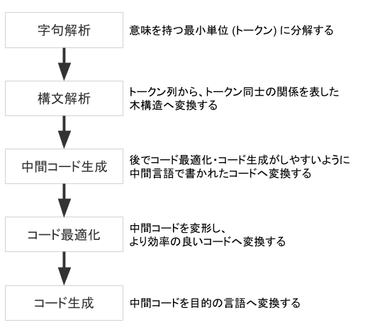

## 動機

## 目的

Go のコンパイラのコードを読むためにあると嬉しい知識をまとめます。

## コンパイラとは

そもそも、コンパイラとは何かをおさらいします。
コンパイラとは、高水準なプログラミング言語で書かれたプログラムをより低水準なプログラミング言語で書かれたプログラムへ変換するプログラムを指します。

一般的に、コンパイラは以下の流れに従ってコンパイルを行います。



### 字句解析

字句解析は、プログラムをトークンの列へ変換します。トークンとは、「意味を持つ最小単位」を指します。例えば、 `x := 1 + 23` という文について見てみましょう。意味を持ったまま `:=` をこれ以上分解することはできませんので、 `:=` はトークンであるといえます。これは `x` や `1` などにも同じことが言えます。よって、 `x := 1 + 23` は `x` `:=` `1` + `23` というトークンの列へ変換されます。

### 構文解析

構文解析は、トークン列からトークン同士の関係を表す木構造へ変換します。
例えば、 `x := 2 + 3 * 6` は以下のような木構造で表現することができます。
このように、構文解析によって得られた木構造を **構文木** と呼びます。

```
   :=
  /  \
 x    +
     / \
    2   *
       / \
      3   6
```

また、これらの構文木からコード生成に不要な部分を削除したものを、 **抽象構文木** (abstract syntax tree; AST) と呼びます。
多くの場合、構文解析ではトークン列から構文木に変換した上で、さらに抽象構文木へ変換します。

## Go のコンパイラについて

主に知られている Go のコンパイルツールチェインは gc、gccgo、gollvm の 3 つです。

### gc

**gc** は `cmd/compile` とも呼ばれ、普段多くの人々が利用している、公式の Go コンパイラの1つです。
本記事で扱います。

gc のコードは[github.com/golang/go/tree/master/src/cmd/compile](https://github.com/golang/go/tree/master/src/cmd/compile)に置かれています。README.md も丁寧に書かれていて、コードにもきちんとコメントが書かれているため、コンパイラに対する知識が少ない状態でも読み進めることができます。

### gccgo

**gccgo** は GCC のフロントエンドで、もう一つの公式の Go コンパイルツールチェインです。
**GCC** は GNU Compiler Collection の略であり、様々なプログラミング言語に対応したコンパイルツールチェインです。
gccgo については [golang.org/doc/install/gccgo](https://golang.org/doc/install/gccgo) にて解説されています。

### gollvm

**gollvm** は LLVM のフロントエンドで、C++ で書かれた gccgo と共通のフロントエンド **gofrontend** を利用しています。
**LLVM** は特定の言語に依存しない中間言語 **LLVM IR** を用いることで、様々な言語に対応可能なコンパイラフレームワークです。
詳しくは [go.googlesource.com/gollvm](https://go.googlesource.com/gollvm/) をご覧ください。


## gc によるコンパイルのフロー

それでは、gc によるコンパイルのフローを追っていきましょう。

<ol style="font-size: 14px;">
<li style="margin: 0;"><code class="language-text">cmd/compile/internal/syntax</code><br>
1.1 ソースコードを字句リストへ分割<br>
1.2 字句リストを構文ツリーへ変換</li>
<li style="margin: 0;"><code class="language-text">cmd/compile/internal/gc</code><br>
2.1 構文ツリーからASTへ変換<br>
2.2 型チェック<br>
2.3 SSA(中間表現)へ変換  </li>
<li style="margin: 0;"><code class="language-text">cmd/compile/internal/ssa</code><br>
3.1 SSAを最適化する<br>
4.1 SSAをコンパイル先のアーキテクチャ向けに書き換える<br>
<li style="margin: 0;"><code class="language-text">cmd/compile/internal/(x86|...)</code><br>
4.2 SSA から機械語を生成</li>
</ol>

### `main`

gc は [src/cmd/compile/main.go](https://github.com/golang/go/blob/go1.15.6/src/cmd/compile/main.go) を `main` パッケージとしています。
つまり、コンパイルはこの `main.main` 関数から開始されます。

ただし、コンパイルが行う実際の処理は `main.main` にはほとんど書かれておらず、実際には 700 行近い関数である [cmd/compile/internal/gc.Main](https://github.com/golang/go/blob/go1.15.6/src/cmd/compile/internal/gc/main.go) が中心となって行われます。`cmd/compile/internal/gc.Main` の冒頭の約 200 行はコマンドライン引数やオプションに関する処理で、実際にコンパイルの対象となるファイルを字句解析・構文解析する処理は 570 行目前後から行われます。

それでは、実際にそれぞれのファイルに対する処理が開始される[ 561 行目](https://github.com/golang/go/blob/go1.15.6/src/cmd/compile/internal/gc/main.go#L561-L576)から見てみましょう。

```go
initUniverse()

dclcontext = PEXTERN
nerrors = 0

autogeneratedPos = makePos(src.NewFileBase("<autogenerated>", "<autogenerated>"), 1, 0)

timings.Start("fe", "loadsys")
loadsys()

timings.Start("fe", "parse")
lines := parseFiles(flag.Args())
timings.Stop()
timings.AddEvent(int64(lines), "lines")

finishUniverse()
```

まず、 `initUniverse` で universe ブロックを用意します。
universe ブロックはすべてのソースファイルが展開されるブロックで、これから読み込まれるあらゆるコードがこのブロックの下に展開されていきます。

次に、各種初期化処理が行われます。 `loadsys` は低レベルなランタイム関数をロードします。
例えば、定義済み関数 `panic` の実装である `gopanic` もここでロードされます。ランタイム関数の実装は [runtime](https://github.com/golang/go/blob/go1.15.6/src/runtime) に置かれています。

その後、いよいよ `parseFiles` でそれぞれのファイルが並列に字句解析・構文解析され、ファイルごとに構文木へ変換されます。
1つのファイルから得られる情報は `noder` 構造体で表現され、ゴルーチンの中で `syntax.Parse` によって字句解析・構文解析が行われた後に、 `noder.file` へ構文木が格納されます。後述する通り、この `noder` 構造体はその後、この時に格納された `noder.file` から AST を生成します。

```go
// parseFiles concurrently parses files into *syntax.File structures.
// Each declaration in every *syntax.File is converted to a syntax tree
// and its root represented by *Node is appended to xtop.
// Returns the total count of parsed lines.
func parseFiles(filenames []string) uint {
	noders := make([]*noder, 0, len(filenames))
	// Limit the number of simultaneously open files.
	sem := make(chan struct{}, runtime.GOMAXPROCS(0)+10)

	for _, filename := range filenames {
		p := &noder{
			basemap: make(map[*syntax.PosBase]*src.PosBase),
			err:     make(chan syntax.Error),
		}
		noders = append(noders, p)

		go func(filename string) {
			sem <- struct{}{}
			defer func() { <-sem }()
			defer close(p.err)
			base := syntax.NewFileBase(filename)

			f, err := os.Open(filename)
			if err != nil {
				p.error(syntax.Error{Msg: err.Error()})
				return
			}
			defer f.Close()

			p.file, _ = syntax.Parse(base, f, p.error, p.pragma, syntax.CheckBranches) // errors are tracked via p.error
		}(filename)
	}

	// 中略 (ここで p.file から AST を生成します)

	return lines
}
```

### `cmd/compile/internal/syntax`

### `cmd/compile/internal/gc`

### `cmd/compile/internal/ssa`

## ランタイム


## ライセンス

本記事に掲載された gc のコードについて

```
Copyright (c) 2009 The Go Authors. All rights reserved.

Redistribution and use in source and binary forms, with or without
modification, are permitted provided that the following conditions are
met:

   * Redistributions of source code must retain the above copyright
notice, this list of conditions and the following disclaimer.
   * Redistributions in binary form must reproduce the above
copyright notice, this list of conditions and the following disclaimer
in the documentation and/or other materials provided with the
distribution.
   * Neither the name of Google Inc. nor the names of its
contributors may be used to endorse or promote products derived from
this software without specific prior written permission.

THIS SOFTWARE IS PROVIDED BY THE COPYRIGHT HOLDERS AND CONTRIBUTORS
"AS IS" AND ANY EXPRESS OR IMPLIED WARRANTIES, INCLUDING, BUT NOT
LIMITED TO, THE IMPLIED WARRANTIES OF MERCHANTABILITY AND FITNESS FOR
A PARTICULAR PURPOSE ARE DISCLAIMED. IN NO EVENT SHALL THE COPYRIGHT
OWNER OR CONTRIBUTORS BE LIABLE FOR ANY DIRECT, INDIRECT, INCIDENTAL,
SPECIAL, EXEMPLARY, OR CONSEQUENTIAL DAMAGES (INCLUDING, BUT NOT
LIMITED TO, PROCUREMENT OF SUBSTITUTE GOODS OR SERVICES; LOSS OF USE,
DATA, OR PROFITS; OR BUSINESS INTERRUPTION) HOWEVER CAUSED AND ON ANY
THEORY OF LIABILITY, WHETHER IN CONTRACT, STRICT LIABILITY, OR TORT
(INCLUDING NEGLIGENCE OR OTHERWISE) ARISING IN ANY WAY OUT OF THE USE
OF THIS SOFTWARE, EVEN IF ADVISED OF THE POSSIBILITY OF SUCH DAMAGE.
```